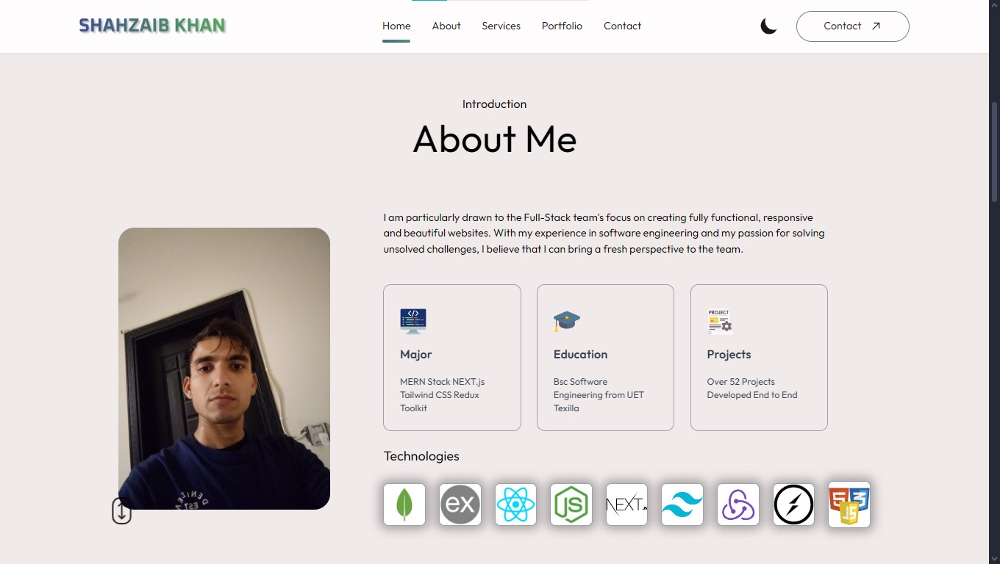

# My Personal Portfolio Website Developed with React.js and Tailwind CSS

I Built a fully functional, responsive and beautiful Personal Portfolio Website using JavaScript, HTML and Tailwind CSS, Git and 
Github and ECMAScript on ReactJs. This website is available on my Github ID. I have also hosted 
this website on Vercel at this address [https://shahzaib-khan.vercel.app](https://shahzaib-khan.vercel.app) to make it 
available to the public

Currently, available on:

- [https://shahzaib-khan.vercel.app](https://shahzaib-khan.vercel.app)

#Home Page

#About Me 

#My Services

#My Projects / Portfolio

#Contact Me

#Footer

